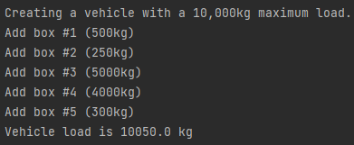
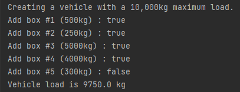
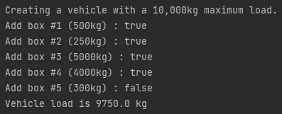
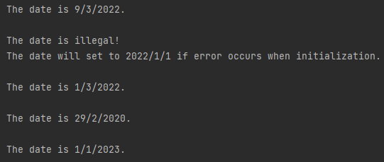

### Assignment 1

> by. 俞贤皓 21301114
>
> 2022.3.8

#### 格式相关

* 文档提供`markdown`、`pdf`和`word`格式
* 文件夹`README`下 存放 **运行结果截图**
* 其他文件夹存放 **代码**

#### 1. SL275 运行结果

##### 1-1 Version 1

* 

##### 1-2 Version 2

* 

##### 1-3 Version 3

* 

#### 2. Date Class 运行结果

* 