### Assignment 10

> by. 俞贤皓 21301114
>
> 2022.5.17

#### 格式相关

* 文档提供`markdown`、`pdf`和`word`格式
* 文件夹`README`下 存放 **运行结果截图**
* 其他文件夹存放 **代码**

#### 1. Mod9 Ex1

* 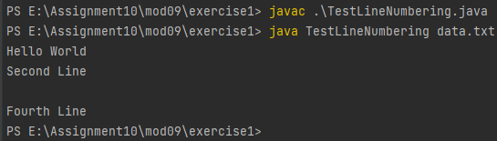
* 

#### 1. Mod15 Ex1

* WriteObject
  * 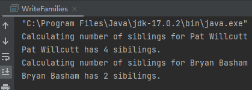
* `families.ser` 
  * 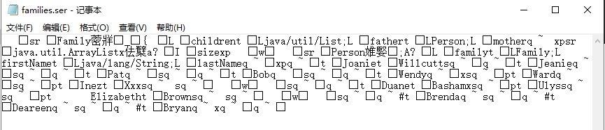
* ReadObject
  * 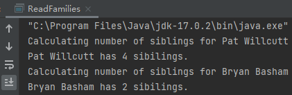

#### 1. Mod15 Ex3

* 本练习中，我建立了一个简易数据库。
* 数据库中每条记录的格式为：name + quantity（String + integer)
* 数据库实现了以下功能：
  1. 显示所有记录
  2. 更新一条记录
  3. 新增一条记录
  4. 删除一条记录
* 实现了一定的防错误输入的功能，不会直接退出数据库。
* 因为篇幅原因，我无法演示所有功能，所以这里只展示一部分功能。

1. 显示所有记录
   * 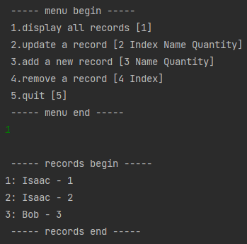
2. 更新一条记录（更新记录2为`Alice - 2`）
   * 
   * 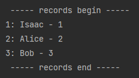
3. 新增一条记录（`Carol 4`）
   * 
   * 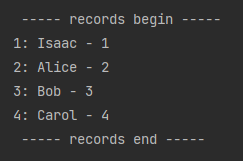
4. 删除一条记录
   * 
   * 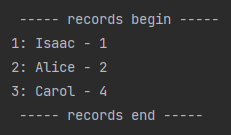

#### 2. the Gourmet Coffee

* TestFileCatalogLoader输出
  * 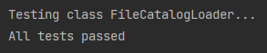

* GourmetCoffee输出

    * 详见`theGourmetCoffee`目录下的， `output.txt`，`PlainText.txt`，`HTML.html`，`XML.xml`

#### 3. StudentSystem

* 控制台输出：
  * 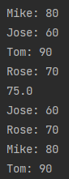
* 文件输出
  * 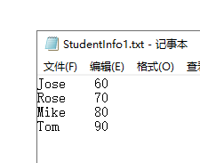

