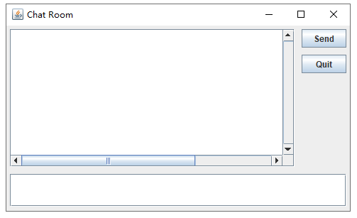
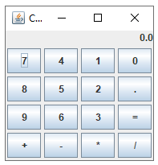
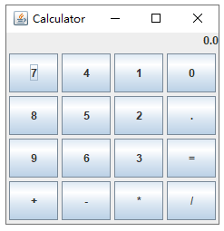
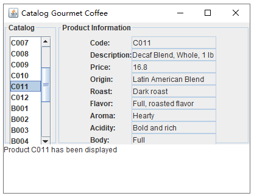
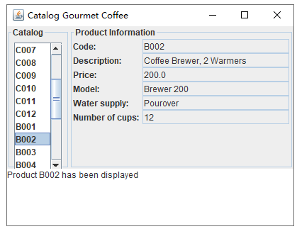
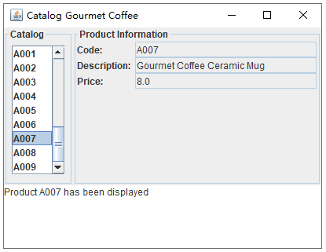

### Assignment 11

> by. 俞贤皓 21301114
>
> 2022.5.25

#### 格式相关

* 文档提供`markdown`和`pdf`格式
* 文件夹`README`下 存放 **运行结果截图**
* 其他文件夹存放 **代码**

#### Mod10 Ex1

* 思路
  * 使用GridBagLayout
  * 将输出框置入一个JScrollPane来实现滚轮
  * 输出框位于西侧，两个按钮位于东侧，输入框位于南侧
  * 输出框占5\*5格，两个按钮占1\*1格，输入框占1\*6格
* 

#### Mod10 Ex2

* 思路
  * 最外层使用BorderLayout(包含输出区域和按钮区域)。
  * 按钮区域使用GridBagLayout，将按钮置入4*4的网格中。
* `size 200 * 200`
  * 
* `size 250 * 250`
  * 

#### The Gourmet Coffee

* 思路
  * 使用GridBagLayout
  * 我额外修改方法`valueChanged`，是为了使输出面板横向拉伸至填满Product Information子面板。
  * 我额外修改属性`LIST_ROWS`，是为了使产品目录在默认参数下不超出子面板。
* 不额外修改代码的结果
  * 
* 额外修改`valueChanged`的结果
  * 
* 额外修改`valueChanged`和`LIST_ROWS`的结果
  * 

