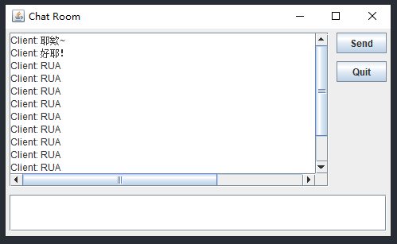
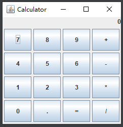
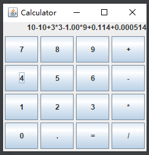
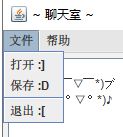
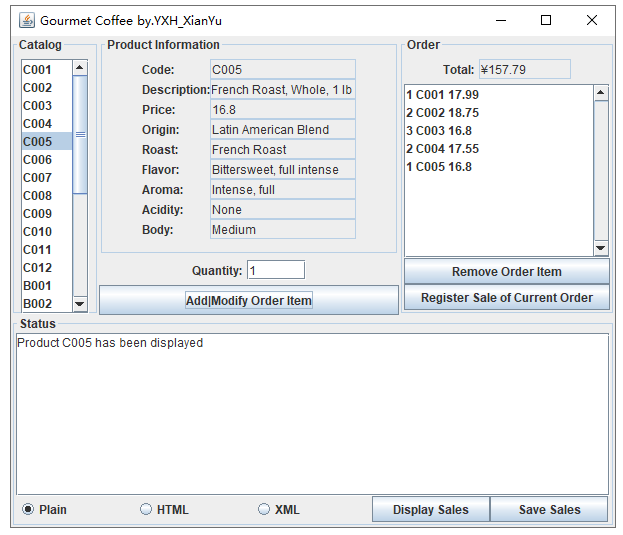
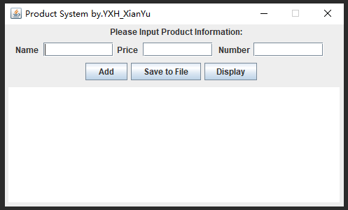
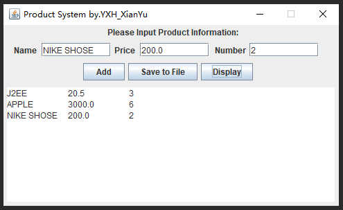

# Assignment 12

> by. 俞贤皓 21301114
>
> 2022.5.31~6.1

### **格式相关**

* 文档提供`markdown`、`pdf`、`html`和`png`格式
  * 因为pdf和word格式都会分页，所以建议使用markdown、html或png阅读，保证排版。
  * html格式的阅读效果最好。
* 文件夹`README`下 存放 **运行结果截图**
* 其他文件夹存放 **代码**

### **1. Mod11 Ex1**

* 

### **2. Mod11 Ex2**

* 思路：所有按钮都对`JLabel`显示的字符串进行更改。`=`按钮进行计算。
* 实现了内部类`CalcListener`。该类完成了以下功能
  * 按钮判断（根据`ActionEvent.getSource()`，得到按钮信息，来判断是哪一个按钮）
  * 输出值清零（变量isDefault记录是否需要清零。在按`=`后，会重置变量isDefault）
  * 根据表达式计算表达式结果
    * 方法`String calculate(String str)`会根据传入的字符串`str`，计算出结果数值。
    * 实现了加减乘除四个运算符的优先级判断。
* 运行结果
  * P.S. 写这周作业的时候，我发现我上周作业计算器的按钮反了，竟然没注意到（扶额）
  * 默认结果
    * 
  * 输入表达式
    * 
  * 输出表达式
    * 

### **3. Mod13 Ex1**

* 运行结果

  1. 选择框和不同用户名输出

     * 
  2. 菜单栏、退出
     * 
  3. 不同颜色的不同字体
     * 
  4. 关于
     * 
     * 

### **4. The Gourment Coffee**

* 运行结果
  * 
  * 
  * 

### **5. Product System**

* 思路
  * 不使用布局管理器，使用setBounds设置绝对坐标来布局。
  * 感谢猫猫同学提醒的这个方法，不然又要多花几个小时。
* Figure 1 The appearance of GUI
  * 
* Figure 2 Add Product object to ArrayList
  * 
* Figure 3 Display product records
  * 
* Figure 4 Write Product records to file
  * 
* Figure 5 File
  * 

