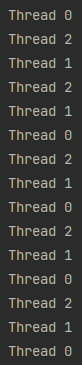
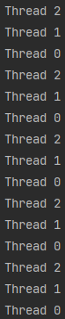
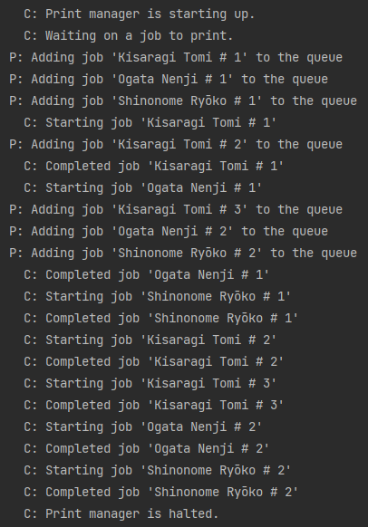
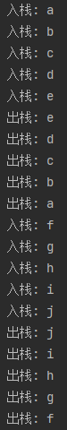
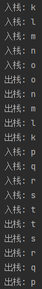

# Assignment 13

> by. 俞贤皓 21301114
>
> 2022.6.9

#### 格式相关

* 文档提供`markdown`、`pdf`和`html`格式
  * 推荐使用`html`格式
* 文件夹`README`下 存放 **运行结果截图**
* 其他文件夹存放 **代码**

#### Mod4 Ex1

*   

#### Mod4 Ex3

* 关于wait/notify的使用：
  * 在addJob()中
    * 若队列已满，则该producer线程进入wait池；
    * 若成功加入job，则notifyAll()，让printer继续getJob()；
  * 在getJob()中
    * 若队列为空，则printer线程进入wait池；
    * 若成功读出job，则notifyAll()，让producer继续addJob()；
  * 我没有让两个方法抛出异常，我直接在方法内对异常进行处理。
* 停止程序的判断方法
  * 若 三个producer线程均执行完毕 且 printer队列为空，则说明程序执行完毕，可以终止printer；
  * 这个方法和标准程序的方法可能不一样，因为我没有利用到halt()方法中synchronized的性质。
* 

#### Thread

* 我在编写这道题目的代码时遇到了一个问题，单例模式被多个线程同时初始化时，会产生多个对象。
  - 解决方法1：修改getInstance方法，使得其线程安全（可以被多个线程同时访问）。
    - [参考文章](http://t.zoukankan.com/meet-p-5290948.html)
  - 解决方法2：在main方法里，先调用一次getInstace方法，使得单例模式初始化完毕。
*     

