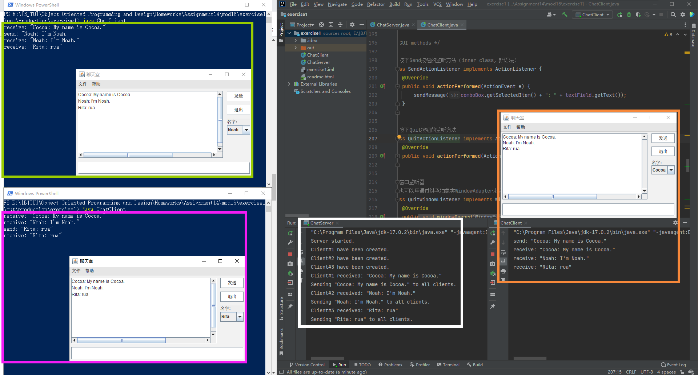
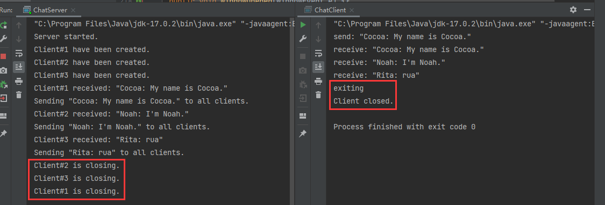
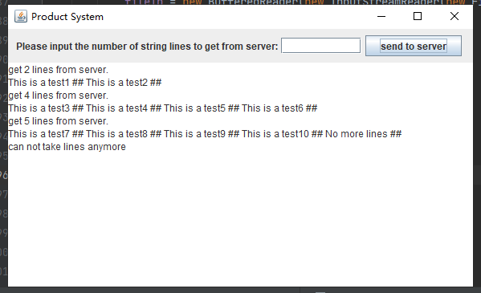

# Assignment 14

> by. 俞贤皓 21301114
>
> 2022.6.16

#### 格式相关

* 文档提供`markdown`、`pdf`和`html`格式
  * 推荐使用`html`格式
* 文件夹`README`下 存放 **运行结果截图**
* 其他文件夹存放 **代码**

#### Mod16 Ex1

* 思路
  * 服务端用ArrayList来管理所有客户端。
  * 接收到来自一个客户端的信息后，将信息转发至所有客户端（包括信息来源客户端，这样可以确保所有客户端信息顺序一致）
* 遇到的问题
  1. 服务端和客户端的输入输出流，如果一方使用readLine()方法读入，那么另一方的所有输出都要保证在末尾存在换行符，否则输入会卡住。
     * 注：readLine()读入时不带换行符。
  2. Socket、输入流、输出流，三者任意关闭一个，均会导致其他两者被关闭。[参考资料](https://blog.csdn.net/cristianoxm/article/details/120197156)
* 运行结果（三客户端）
  * 

* 运行结果（退出客户端）
  * 

#### Network

* 运行结果
  * 