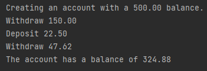
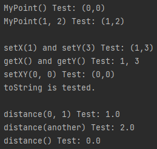

### Assignment 2

> by. 俞贤皓 21301114
>
> 2022.3.15

#### 格式相关

* 文档提供`markdown`、`pdf`和`word`格式
* 文件夹`README`下 存放 **运行结果截图**
* 文件夹`Javadoc_*`下 存放 **Javadoc文档**
* 其他文件夹存放 **代码**

#### 1. SL275 运行结果

* 

#### 2. The MyPoint Classes 运行结果

* 
* Javadoc生成的文档，见文件夹`Javadoc_MyPoint`