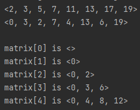
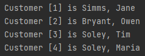
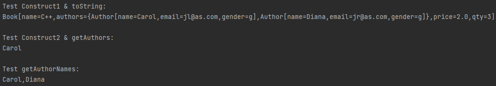

### Assignment 4

> by. 俞贤皓 21301114
>
> 2022.3.30

#### 格式相关

* 文档提供`markdown`、`pdf`和`word`格式
* 文件夹`README`下 存放 **运行结果截图**
* 其他文件夹存放 **代码**

#### Module 5 Ex.1 

* 

#### Module 5 Ex.2

* 

#### Book

* 

