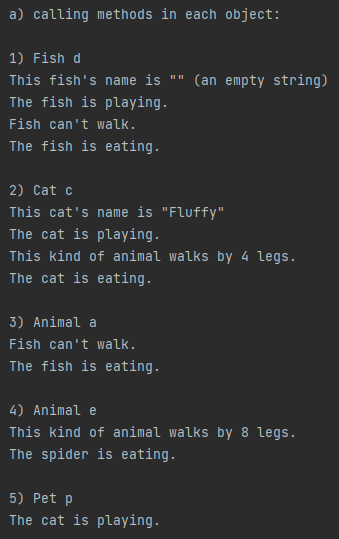
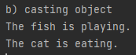
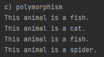
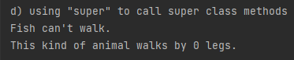
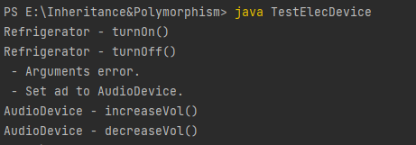
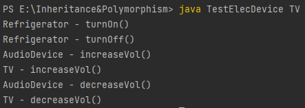
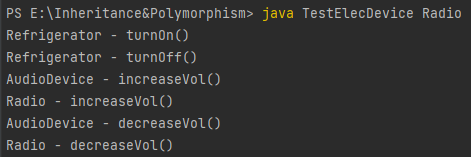

### Assignment 7

> by. 俞贤皓 21301114
>
> 2022.4.19

#### 格式相关

* 文档提供`markdown`、`pdf`和`word`格式
* 文件夹`README`下 存放 **运行结果截图**
* 其他文件夹存放 **代码**

#### 1. SL275 Module7 Ex.2

##### 1-1 调用每个对象的方法

##### 1-2 对象类型转换（通过将Animal a转换为Fish，将Pet p转换为Cat来演示）

##### 1-3 多态（通过TestElecDevice类中的polymorphismChecker方法来演示）

##### 1-4 通过super来调用父类方法（在Fish类中添加了superWalk方法来演示）

#### 2. Inheritance & Polymorphism

##### 2-1 无命令行参数(或参数错误)

##### 2-2 命令行参数为"TV"

##### 2-3 命令行参数为"Radio"

