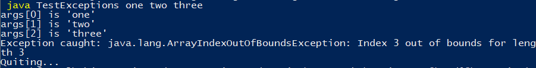

### Assignment 8

> by. 俞贤皓 21301114
>
> 2022.4.28

#### 格式相关

* 文档提供`markdown`、`pdf`和`word`格式
* 文件夹`README`下 存放 **运行结果截图**
* 其他文件夹存放 **代码**

#### 1. Module 8 Ex.1

* 

#### 2. Module 8 Ex.2

* 

#### 3. the Gourmet Coffee System

##### 3.0 说明

* `.\TheGourmetCoffeeSystem\`下，存放要求编写的代码
* `.\TheGourmetCoffeeSystem\lib\`下，存放`student-files .zip`提供的代码

##### 3.1 文本文件：

* 

##### 3.2 html文件：

* 

##### 3.3 xml文件

* 