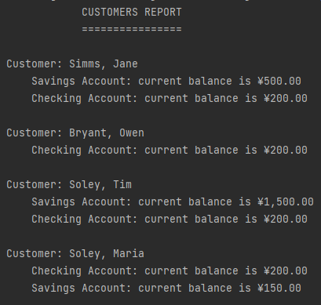
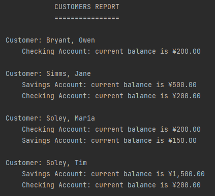
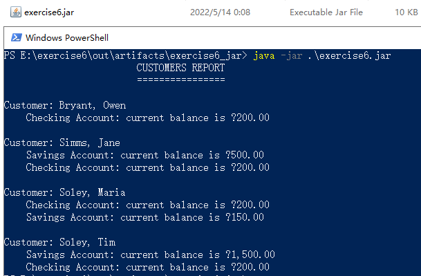
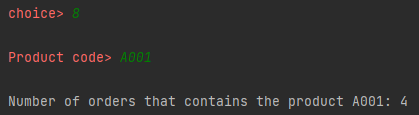
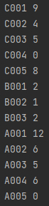

### Assignment 9

> by. 俞贤皓 21301114
>
> 2022.5.15

#### 格式相关

* 文档提供`markdown`、`pdf`和`word`格式
* 文件夹`README`下 存放 **运行结果截图**
* 其他文件夹存放 **代码**

#### Module 9 Exercies 3

* 

#### Module 9 Exercise 4

* 

#### Module 9 Exercise 6

* 

#### The Gourmet Coffee System

* 
* 

